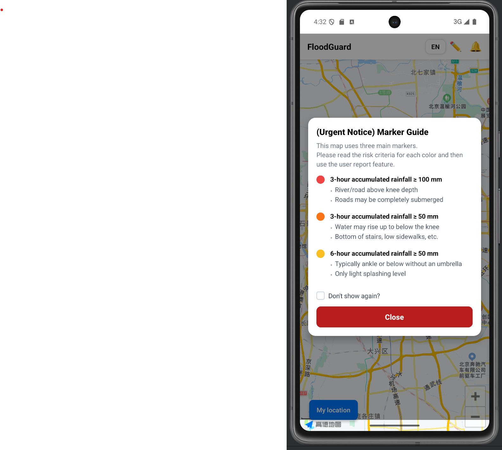
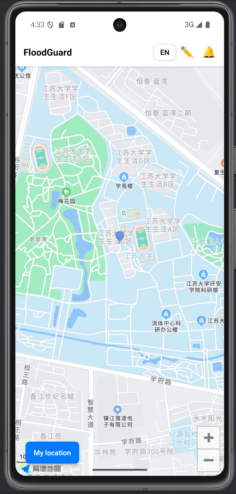
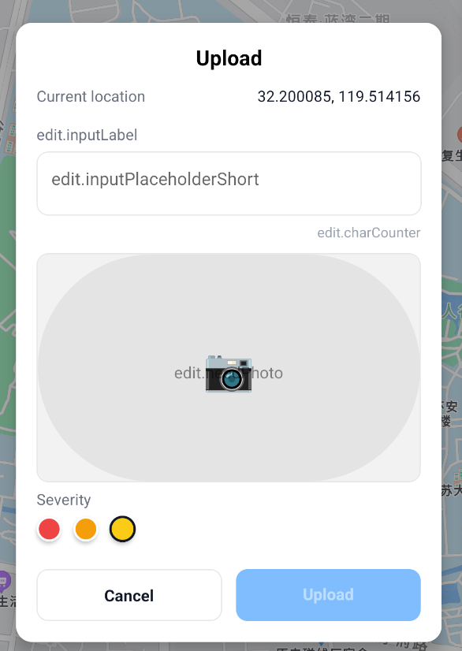
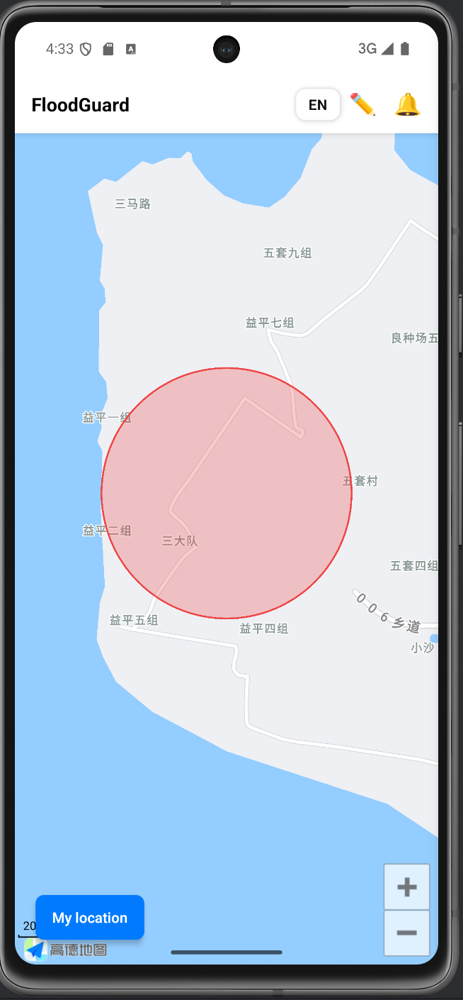

# 🌊 Flood Guard – 홍수 위험 알리미  
> 🏆 **Bronze Award @ SP!ED 2025**  
> 📍 Jiangsu University | 2025.08.18 ~ 2025.08.25

---

## 📌 프로젝트 개요
**Flood Guard**는 실시간 강수량 데이터와 사용자 참여형 신고를 기반으로  
홍수 위험 지역을 시각화하고, 사용자에게 경고를 제공하는 모바일 애플리케이션입니다.

---

## 👥 팀 정보
| 구분 | 내용 |
|------|------|
| 팀명 | SP!ED 2025 Team 18 (Eco5ive) |
| 인원 | 총 5명 (한국 4명 🇰🇷 + 중국 1명 🇨🇳) |
| 역할 분담 | 기획 · 프론트엔드 · 백엔드 · 디자인 · 데이터 처리 등 협업 진행 |

---

## 🚀 주요 기능
- 🗺️ **실시간 지도 기반 시각화** (AMap API)
- 🌧️ **QWeather API 기반 강수 예측**
- 📸 **사용자 신고 + 사진 업로드**
- 🔔 **위험 알림 토스트 + 사이드바**
- 🌐 **다국어 지원 (KO / EN / JA / ZH)**

---

## 🛠 기술 스택
| 구분 | 사용 기술 |
|------|------------|
| 프레임워크 | `React Native (tsx)` |
| 지도 | `react-native-amap3d`, `AMap API` |
| 날씨 | `QWeather API` |
| 상태/알림 | Context API, Custom Toast |
| 다국어 | `i18next` + AsyncStorage |
| 기타 | 이미지 랜덤 선택(해단 프로젝트에 적합한 이미지 촬영 불가) , 사용자 모달, 예측 오버레이 등 |

---

## 🖼 앱 화면 미리보기

## 🖼 앱 화면 미리보기

<p align="center">
  <table>
    <tr>
      <th>첫 화면</th>
      <th>내 위치 이동</th>
      <th>신고 작성</th>
      <th>위험 안내</th>
    </tr>
    <tr>
      <td></td>
      <td></td>
      <td></td>
      <td></td>
    </tr>
  </table>
</p>

---

## 🏃 실행 방법
```bash
# 설치
npm install

# Android 실행
cd android
./gradlew clean
cd ..
npx react-native run-android

# iOS (Mac 환경)
npx pod-install
npx react-native run-ios
